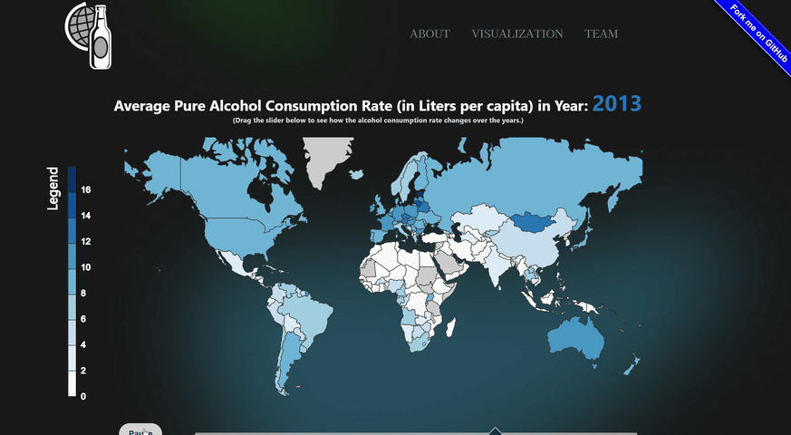

# Data Visualization Final Project - COSI 116A - Group 13
### GitHub Pages Website
https://deborahengelberg.github.io/COSI116A-Brandeis-InfoVis-Fall24.github.io/ 

### Team Members
Debbie Engelberg, Cameron Sherman, Noam Reiner, Mackenzie Chung

### Teaching Staff
Prof. Cashman and TA Aby Iberkleid Szainrok

### Project's Primary Purpose

Our project focuses on visualizing and analyzing how alcohol consumption rates across various countries influence death rates, comparing these impacts to other leading causes of death over multiple years. By highlighting the relationship between alcohol consumption and mortality, this project aims to support healthcare professionals and prevention practitioners in reducing drinking-related risks, offering valuable data to observe and compare global trends.

## SetUp
1. Clone this repository to your local machine. E.g., in your terminal / command prompt `CD` to where you want this the folder for this activity to be. Then run `git clone <YOUR_REPO_URL>`

1. `CD` or open a terminal / command prompt window into the cloned folder.

1. Start a simple python webserver. E.g., one of these commands:
    * `python -m http.server 8000`
    * `python3 -m http.server 8000`
    * `py -m http.server 8000`
    
    If you are using Python 2 you will need to use `python -m SimpleHTTPServer 8000` instead, but please switch to Python 3 as [Python 2 will be sunset on 2020.01.01](https://www.python.org/doc/sunset-python-2/).

1. Wait for the output: `Serving HTTP on 0.0.0.0 port 8000 (http://0.0.0.0:8000/)`

1. Now open your web browser (Firefox or Chrome) and navigate to the URL: http://localhost:8000

## Execution
### Languages and Libraries Used

* JavaScript
* HTML
* CSS
* Python
* JSON
* TopoJSON
* Pandas
* D3.js

#### <ins> Step 1 - Brainsotrming Ideas  and Looking for Data</ins>

As a group, we quickly decided that we wanted to implement a map visualization in our final project. Our initial idea was to show different types of transportation and their frequencies around the world. However, as we began searching for data, we quickly realized that it was very difficult to find free, accurate transportation data. As a result, we shifted our focus to another type of global data. While researching, we discovered data related to alcohol consumption and causes of death, and we became curious about whether there might be a correlation between the two. This led us to combine these two data sets for our final project.
 

#### <ins> Step 2 - Data Cleaning</ins>

For the data cleaning we used Python's Panadas library. We combined four datasets: one on causes of death and three on alcohol consumption. For the cause of death data, we cleaned unnecessary columns, filled null cells, added a total count column, and standardized data types. The alcohol consumption datasets were reformatted and aligned, ensuring consistency for merging. After integrating the datasets by year and country. For interaction with the Json of the map, we added alpha-2 countries codes.

* Link to data cleanning: [Google Colab - Data Cleaning](https://colab.research.google.com/drive/1CXzDcB9EuiBlps0GL37_qgG_ykGpNrow?usp=sharing)
 

## Visualization Demonstrations
### Visualization 1: Brushing & Linking

This is our first visualization, which uses three types of charts: a map, a line chart, and a bar chart, all connected through linking and brushing.

* The map displays the distribution of alcohol consumption across the world for a selected year.
* The line chart examines death rates over the years.
* The bar chart shows alcohol consumption trends over the years.
  
When a user selects a year on the map, the corresponding year is highlighted in both the line chart and the bar chart. Similarly, selecting multiple years in the line chart or bar chart highlights them in the other chart through brushing and linking.
Additionally, the map includes a play feature that cycles through the years at set intervals, dynamically updating the highlights in the line and bar charts to reflect the current year.

### Visualization 2: Deaths by Cause with Zooming & Panning

This is our second visualization, which features an interactive map based on user inputs: year, color, and the selected cause of death. Users can choose a year and cause of death from two dropdown menus, and the map dynamically updates to display the data. Countries are shaded according to the number of reported deaths for the selected cause in the chosen year. The shading intensity aligns with the user-selected color: the closer a country's shade is to the chosen color, the higher the number of deaths. The map also includes zoom and pan functionality, allowing users to focus on specific regions or hover over countries to view detailed death counts. This feature is particularly useful for exploring smaller countries more closely.

### Visualization 3: Brushing & Linking

This is our final visualization, which uses a map and a bar chart. It employs three parameters to display the data: a specific country, year, and data type. Once a country is chosen, it is highlighted on the map, and shows a larger representation of its borders below the map. At the bottom, there is a recap of the total for the selected data type that year. Below that, the visualization compares the chosen year with the prior year and the year after.

## Conclusion

At the end of our project, we were able to somewhat recreate our top 3 visualization sketches and successfully connected the datasets to our maps and graphs. For visualization 1 (Brushing & Linking), all the main components were implemented, including the timeline slider, the line chart, and the bar graph -- However, the style for the slider and legend was a bit off from the original sketch. It also got a bit messy when figuring out how to connected the slider to the map, line chart, and bar graph. Visualization 2 (Causes of Death Across Countries with Zooming and Panning) was also implemented with the map, dropdowns, and legend, and closley matched the original sketch. The programmer for visualization 2 also added the ability to zoom in and out, making the map more interactive. But although interactive, the layout of the page can vary depending on the size of the screen which may lead to inconsistencies with objects overlapping. In visualization 3, it also uses the map and dropdowns for the user to select a country and year, and displayed the data below the map. And similar to visualization 3, the layout of the page can vary depending on the size of the screen or browser (as noticed by one of our team member). Our UI was also close to how we had envisioned in our sketches, but we also realized that the background can make reading the map a bit more challenging so we'll take that into acount for future projects. Overall, the created project was a big sucess, but there are definitely still areas for improvement.

## Acknowledgments
- [D3: Data-Driven Documents](https://d3js.org/) by Mike Bostock.
- [Let's Make a Map](https://bost.ocks.org/mike/map/) by Mike Bostock.
- [Pure CSS responsive "Fork me on GitHub" ribbon](https://codepo8.github.io/css-fork-on-github-ribbon/#) by Chris Heilmann.
- [infoVizGroup8](https://github.com/aiberk/infoVizGroup8) by TA Aby and Team 8 (From 2023).
- COSI 116A - Homework 4 - Brushing and Linking.
- [Downloadable GeoJSON](https://geojson-maps.kyd.au/?utm_source=self&utm_medium=redirect).
- [Dataset for Alcohol Consumption Rate (Liters per Capita)](https://apps.who.int/gho/data/view.main.52395) by The World Health Organization.
- [Dataset for Causes of Deaths Around the World](https://www.kaggle.com/datasets/iamsouravbanerjee/cause-of-deaths-around-the-world) by Sourav Banerjee.
- [Dataset for Global Births and Deaths Projections](https://www.kaggle.com/datasets/shreyasur965/births-and-deaths) by Shreya Sur965.

